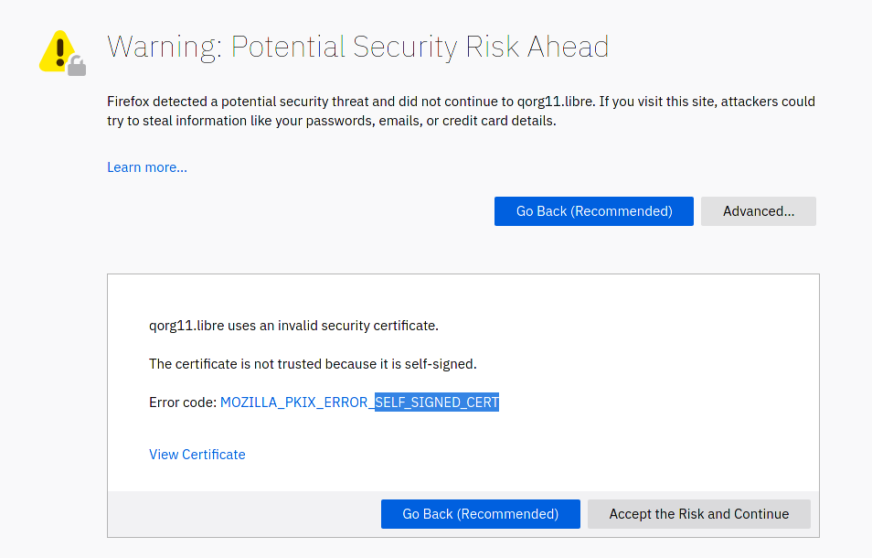

# Certificate authority and its consequences have been a disaster for the human race

>Should CA exist in 2k20?

--- Me

>no. 
>I don't see a problem in self-signed ceritificates for web to be
>honest. Instead of relying on CA, browser should remember it's
>fingerprint and warn if it was changed.

--- a1batross

>please add certificate chains and the insane prices from verisign or
>such that are literally a govt-funded scam :DDDD

--- caskd

Ever wondered why you have to pay to secure your website? Or trust
whatever ACME is?

There are companies who got their crypto signatures hardcoded in
browsers, so the browser automatically accepts that signature without
asking you. And you have to ***renew*** the cert every year/3
months/dunno. This wouldn't happen with self signed certs, since you
don't have to renew them ever because... you made them...

When you visit a website that doesn't have a certificate signed by a
shill, you get this:

Browser may say that the website is insecure and shit, but it isn't:
the connection is still **perfectly** secure between you and the
server. Or even stronger, since self signed certs can be whatever you
want, RSA8192, ECC512, you name it. 

I trust more **my friend's** signature than some random corporation,
who got their signature *hardcoded* in browsers.

## Why does this thing exist?

* Corps can make money out of this
* Monopolies, It's not that easy to get your signature hardcoded in
  browsers.

## Alternatives

* What a1batross said.
* TOFU: (Trust on first use) (What ssh prompts when you log in for
  first time)
* Use .onion, .i2p, .loki... Any of those works without CA and it's
  perfectly end to end encrypted
