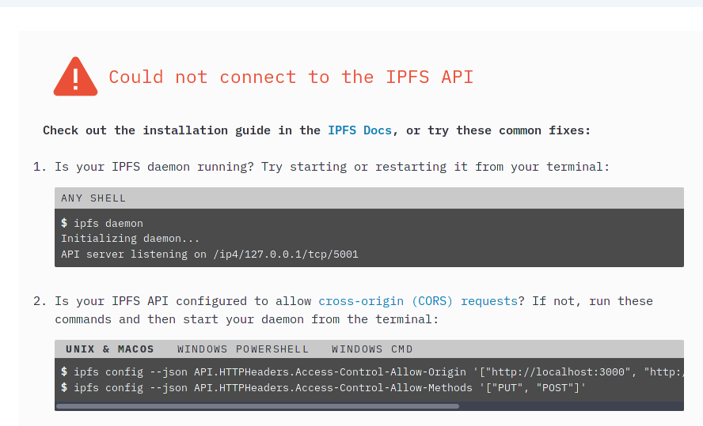

# ipfs sucks

So, i run `ipfs daemon` in my terminal, and it told me to go to
127.0.0.1:5001, okay, there i go

And i got this

After 30 minutes of debugging what was happening, i discovered that
IPFS checks the connection... using javascript

also weird javascript, because i went to the same website in chromium
and i got this:

Why does your web interface need esoteric JS to check if a daemon is
running? jesus

The IPFS web interface is completely unusable if the daemon "isn't
running"

# Alternatives

freenet, dunno

