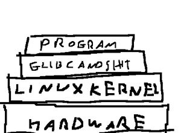
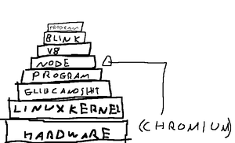

# JavaScript and its consequences have been a disaster for the human race

JavaScript is a programming language often used on websites. To create
dynamic content on client end. Some dudes thought that extracting the
V8 (chromium javascript interpreter) and making it a executable file
to run javascript outside the browser was a good idea and now we're
doomed.

JavaScript is not only stupid (javascript returns true when) ```true +
true === 2``` Which means that true is literally ```#define true 1```

At the end that doesn't matters. Because it's a useless fact to be
honest. It only shows how bad designed the shit is. But the pain starts
when you actually use that programming language.

## Developers idiocy

First of all the language is slow as fuck. And websites are BLOATED of
JavaScript nowadays. Adding ***USELESS*** function i'd never like to
use, or functions I already disabled on my browser. Such as smooth
scrolling. I hate smooth scrolling. But some websites force me to use
it because JavaScript.

## Idiocy examples

~~~

<true + true === 2
>true
<true == "1"
>true
<false == 0
>true
<false == "0"
>true

<false == undefined
>false
>false == null
<false

<null == undefined
>true

// I specially like this one

<[]+{}
>"[object Object]"
<{}+[]
>0

~~~

## Disabling JavaScript

Unless you only use 1.0 websites. Disabling javascript will broke your
internet experience, but will make it way faster. just install
noscript and have fun with your sane browser.

# NodeJS

Node is what happens when you extract the JavaScript interpreter from
chromium and put it on the desktop. This allows the user to execute
.js files on the desktop without a browser. Which is stupid. A web
programming language shouldn't be on desktop. Just on the web. But
thanks to this great idea we've now worse things

(Node isn't even a JavaScript implementation. It is just the V8 engine
outside the Chromium browser. Meaning that node is just a part of
chromium with marketing)

# Syntax
The syntax was written by a gorilla, it uses camelCase, (I don't
like it, but well, i can live with it).

for example, `in JS you do document.getElementById("foobar");` I guess
this is ok, but like I said, this was written by a monkey, becuase
then we have functions: `XMLHttpRequest` <-- What the hell?  Why is
XML capitalized, but Http isn't?  A good language, let's say, C, would
have done it like this: `xml_http_request`; (which is saner)
or `XML_http_request()` if you use the weird OpenSSL functions names lol


# Electron

Electron is what happens when you hire web developers but you gotta
make the program aviable for the desktop. The problem is that
JavaScript can't do graphics (as far as I know, there's no X11 library
for JavaScript, thankfully) So what do they do to use GUIs on
JavaScript? Make every program a mini-chromium browser! So every
program that's running electron is just chromium browser. Which is
truly stupid. And a lazy way to do programming.

Here's what is needed to run a program (Written in a compiled language) in GNU/Linux:



And this is what is needed to run a program written in electron:



# Links

[JAVASCRIPT WAS A MISTAKE](http://www.bordi.ga/blog_shit/js.html)


